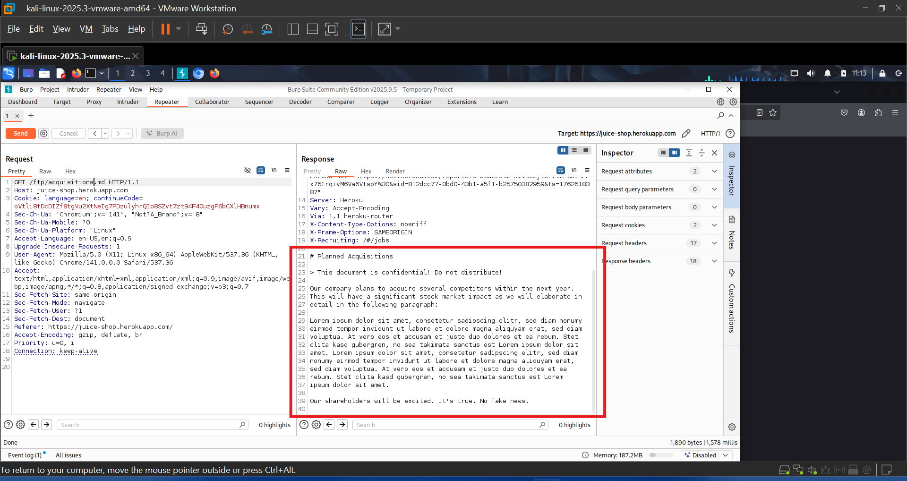
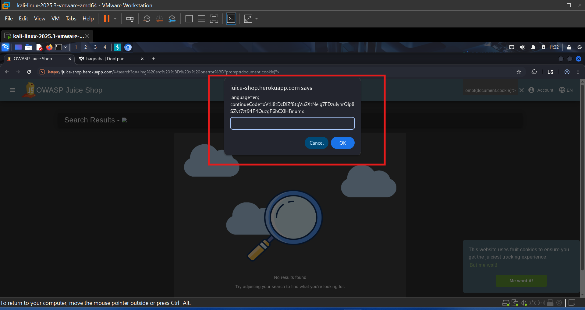
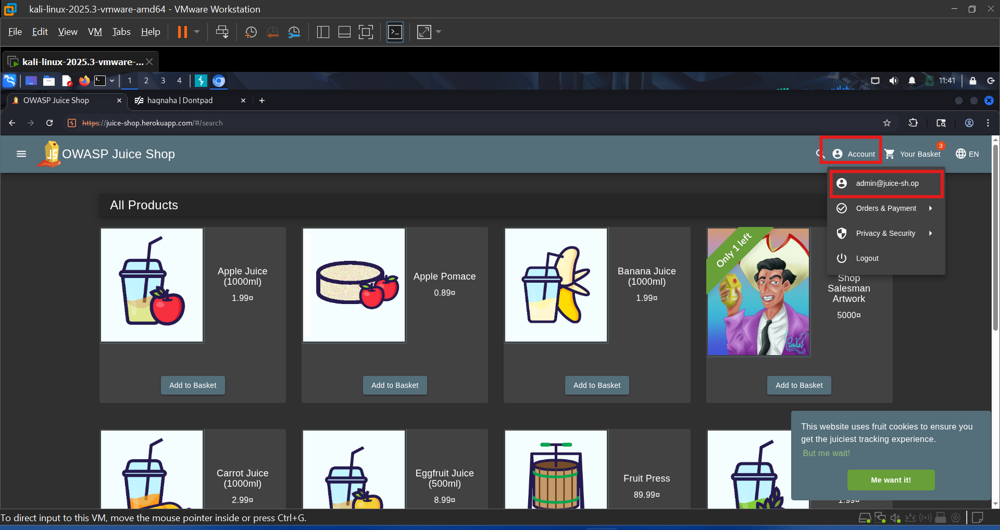
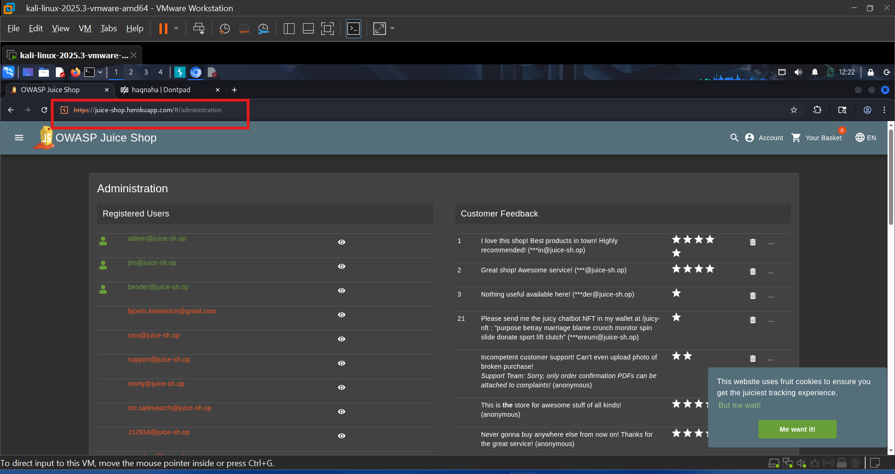
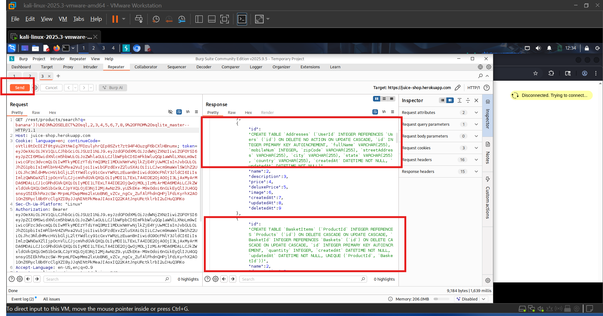

# SMPL_CS_PRJ_01_Securing_Digital_Marketplace
# Securing the Digital Marketplace: Strengthening Security for Vulnerable Websites

## Overview

This project focuses on identifying, analyzing, and documenting critical web application security vulnerabilities in a controlled environment using the OWASP Juice Shop application. The assessment simulates real-world penetration testing activities, including reconnaissance, vulnerability exploitation, access control testing, and security reporting.

The objective was to evaluate the security posture of the application, demonstrate the impact of common web vulnerabilities, and provide actionable recommendations to improve overall security.

---

## Project Objectives

* Perform web application reconnaissance and information gathering.
* Identify and validate high-risk vulnerabilities.
* Simulate real-world attack scenarios.
* Assess authentication and authorization mechanisms.
* Evaluate the impact of discovered vulnerabilities.
* Recommend security controls and remediation strategies.
* Document findings in a professional security assessment report.

---

## Project Highlights

✅ Conducted Web Application Security Assessment

✅ Performed Reconnaissance using Burp Suite

✅ Identified SQL Injection (SQLi) Vulnerabilities

✅ Discovered Cross-Site Scripting (XSS) Vulnerabilities

✅ Tested Access Control Mechanisms

✅ Analyzed Sensitive Data Exposure Risks

✅ Performed Database Exfiltration Testing

✅ Documented Security Findings and Mitigation Strategies

---

## Environment & Tools

| Tool                    | Purpose                              |
| ----------------------- | ------------------------------------ |
| Kali Linux              | Penetration Testing Environment      |
| Burp Suite              | HTTP Traffic Interception & Analysis |
| OWASP Juice Shop        | Vulnerable Web Application           |
| Browser Developer Tools | Source Code Inspection               |
| Burp Repeater           | Request Manipulation & Testing       |

---

## Assessment Methodology

### 1. Reconnaissance

Initial reconnaissance was performed to identify application endpoints, resources, and potential attack surfaces. HTTP requests and responses were intercepted and analyzed using Burp Suite.

### 2. Vulnerability Assessment

The application was tested for common web application vulnerabilities, including:

* Sensitive Data Exposure
* Cross-Site Scripting (XSS)
* SQL Injection (SQLi)
* Poor Error Handling
* Privacy Policy Exposure
* Broken Access Control
* Database Exfiltration
* Misplaced SIEM Signature Files

### 3. Access Control Testing

Authorization controls were evaluated by attempting to access restricted resources and administrative functionality without proper privileges.

### 4. Reporting

All findings were documented with evidence, risk analysis, impact assessment, and remediation recommendations.

---

## Key Findings

| Vulnerability                 | Severity |
| ----------------------------- | -------- |
| SQL Injection (SQLi)          | Critical |
| Broken Access Control         | Critical |
| Sensitive Data Exposure       | High     |
| Database Exfiltration         | High     |
| Cross-Site Scripting (XSS)    | High     |
| Poor Error Handling           | Medium   |
| Misplaced SIEM Signature File | Medium   |
| Privacy Policy Exposure       | Low      |

---

## Screenshots

### Sensitive Data Exposure

Demonstrates unauthorized access to sensitive files through manipulated HTTP requests.

### Cross-Site Scripting (XSS)

Validation of XSS vulnerability through execution of a malicious payload.

### SQL Injection Authentication Bypass

Successful authentication bypass using SQL Injection techniques.

### Broken Access Control

Unauthorized access to administrative functionality.

### Database Exfiltration via SQL Injection

Extraction of database information through SQL Injection exploitation.

---

## Security Recommendations

### Input Validation & Sanitization

* Validate all user inputs.
* Encode output data.
* Implement server-side validation.

### SQL Injection Prevention

* Use parameterized queries.
* Implement prepared statements.
* Avoid dynamic SQL queries.

### Access Control Improvements

* Enforce Role-Based Access Control (RBAC).
* Apply the Principle of Least Privilege.
* Validate authorization on every sensitive request.

### Secure Error Handling

* Display generic error messages.
* Log detailed errors securely on the server.

### Sensitive Data Protection

* Restrict access to confidential resources.
* Implement authentication and authorization controls.
* Remove sensitive files from public directories.

### Security Monitoring

* Deploy SIEM solutions.
* Implement Web Application Firewall (WAF).
* Perform continuous monitoring and periodic security reviews.

---

## Skills Demonstrated

* Web Application Security
* Vulnerability Assessment
* Penetration Testing
* Burp Suite
* OWASP Top 10
* SQL Injection Testing
* Cross-Site Scripting (XSS)
* Access Control Testing
* HTTP Request Analysis
* Security Reporting
* Risk Assessment
* Ethical Hacking

---

## Project Report

A detailed report containing methodology, testing procedures, screenshots, findings, risk analysis, and remediation recommendations is available in the repository.

📄 **Report:** `Project Report/Securing the Digital Marketplace Strengthening Security for Vulnerable Websites Project.pdf`

---

## Learning Outcomes

This project provided hands-on experience in identifying and exploiting common web application vulnerabilities while understanding their business impact. It strengthened practical skills in web security testing, attack simulation, vulnerability analysis, and security reporting.

---

## Disclaimer

This project was conducted exclusively in a controlled educational environment using OWASP Juice Shop, an intentionally vulnerable application designed for cybersecurity training and learning purposes.

The techniques demonstrated in this project should only be used on systems where explicit authorization has been granted.

---

## Author

**Ashish Yadav**

Cybersecurity Enthusiast | Aspiring SOC Analyst | Security Researcher

Connect with me on LinkedIn and GitHub to follow my cybersecurity learning journey and projects.
